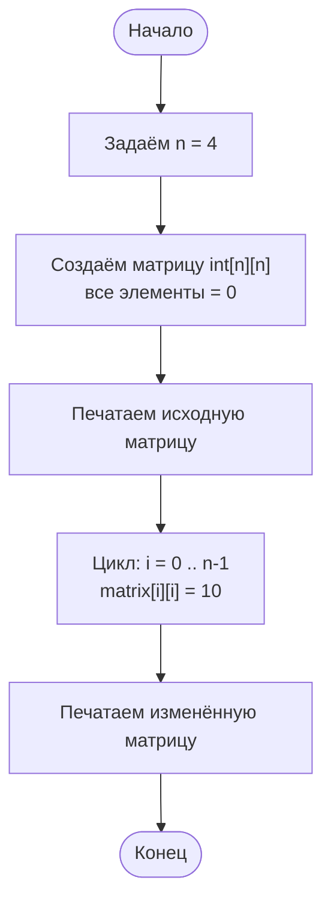
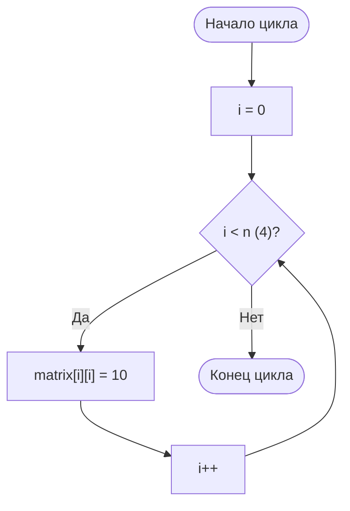
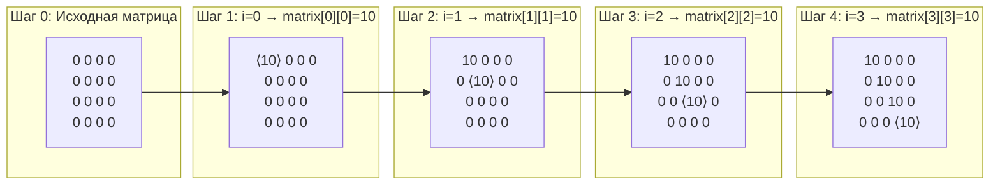
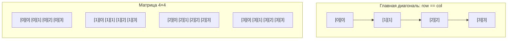

# DiagonalReplace — пошаговая диаграмма алгоритма

## Общая схема алгоритма

## Детальная работа цикла замены диагонали

## Пошаговое изменение матрицы

## Связь индексов с позициями в матрице

> **Ключевая идея:** на главной диагонали индекс строки всегда равен индексу столбца (`i == j`), поэтому достаточно одного цикла с `matrix[i][i] = 10`.
